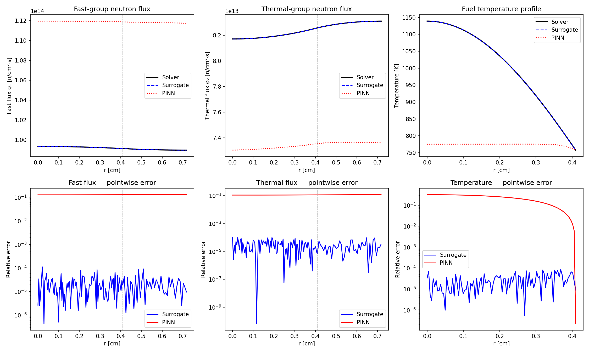

# NeuTherm-PINN

**Physics-Informed Neural Networks for Coupled Neutron Diffusion and Heat Conduction in Nuclear Fuel Elements**

[](https://www.python.org/)
[](https://pytorch.org/)
[](LICENSE)

---

## Overview

This project implements and compares two deep learning approaches for solving the **steady-state coupled neutronics–thermal-hydraulics problem** in a cylindrical fuel pin (1D radial geometry, representative of a PWR fuel element):

1. **Surrogate Model (data-driven):** A neural network trained on reference solutions generated by a finite-difference solver, learning the mapping from physical parameters to the coupled neutron flux and temperature fields.

2. **Physics-Informed Neural Network (PINN):** A neural network that encodes the governing partial differential equations directly into the loss function, requiring little or no labeled data while respecting the underlying physics.

Both approaches are benchmarked against a classical iterative numerical solver (Picard iteration with finite differences) and, where available, analytical solutions.

---

## Physical Problem

We consider a single cylindrical fuel pin of radius $R_f$ surrounded by a cladding of outer radius $R_c$ and a coolant channel, under the following assumptions:

- **Steady-state** operation
- **1D radial** geometry (infinite axial length)
- **Two-energy-group** neutron diffusion
- **Temperature-dependent** macroscopic cross sections (Doppler feedback)
- **No azimuthal dependence** (symmetry)

This configuration captures the essential physics of the neutron–thermal coupling: fission neutrons deposit energy in the fuel, raising the temperature, which in turn modifies the neutron interaction cross sections — creating a nonlinear feedback loop.

### Governing Equations

#### 1. Two-Group Neutron Diffusion

The steady-state neutron diffusion equations in two energy groups for a 1D cylindrical geometry are [[1]](#references):

**Fast group** ($g = 1$):

$$-\frac{1}{r}\frac{d}{dr}\left(r\,D_1(T)\,\frac{d\phi_1}{dr}\right) + \Sigma_{r,1}(T)\,\phi_1(r) = \frac{1}{k_{\text{eff}}}\left(\nu\Sigma_{f,1}(T)\,\phi_1(r) + \nu\Sigma_{f,2}(T)\,\phi_2(r)\right)$$

**Thermal group** ($g = 2$):

$$-\frac{1}{r}\frac{d}{dr}\left(r\,D_2(T)\,\frac{d\phi_2}{dr}\right) + \Sigma_{a,2}(T)\,\phi_2(r) = \Sigma_{s,1\to2}(T)\,\phi_1(r)$$

where:
| Symbol | Description |
|--------|-------------|
| $\phi_g(r)$ | Scalar neutron flux in group $g$ $[\text{n}\cdot\text{cm}^{-2}\cdot\text{s}^{-1}]$ |
| $D_g(T)$ | Diffusion coefficient in group $g$ $[\text{cm}]$ |
| $\Sigma_{r,1}(T)$ | Removal cross section from group 1 $[\text{cm}^{-1}]$ |
| $\Sigma_{a,2}(T)$ | Absorption cross section in group 2 $[\text{cm}^{-1}]$ |
| $\nu\Sigma_{f,g}(T)$ | Fission production cross section in group $g$ $[\text{cm}^{-1}]$ |
| $\Sigma_{s,1\to2}(T)$ | Scattering cross section from group 1 to 2 $[\text{cm}^{-1}]$ |
| $k_{\text{eff}}$ | Effective multiplication factor |
| $T(r)$ | Temperature field $[\text{K}]$ |

The temperature dependence of the cross sections introduces the nonlinear coupling. Following the standard Doppler broadening model [[1, 2]](#references), the cross sections are parametrized as:

$$\Sigma_x(T) = \Sigma_x(T_{\text{ref}})\left(1 + \alpha_x\sqrt{T - T_{\text{ref}}}\right)$$

where $\alpha_x$ is the temperature coefficient for reaction type $x$, and $T_{\text{ref}}$ is a reference temperature (typically 300 K for tabulated data).

#### 2. Heat Conduction in the Fuel Pin

The steady-state radial heat conduction equation in the fuel region is [[3]](#references):

$$-\frac{1}{r}\frac{d}{dr}\left(r\,k_f(T)\,\frac{dT}{dr}\right) = q'''(r)$$

where the volumetric heat generation rate is given by the neutron flux:

$$q'''(r) = \kappa_f\left(\Sigma_{f,1}(T)\,\phi_1(r) + \Sigma_{f,2}(T)\,\phi_2(r)\right)$$

with $\kappa_f \approx 200\;\text{MeV/fission} \approx 3.204 \times 10^{-11}\;\text{J/fission}$ being the energy released per fission event, and $k_f(T)$ the temperature-dependent thermal conductivity of UO₂ fuel [[3]](#references):

$$k_f(T) = \frac{1}{A + B\,T} + C\,T^3$$

with empirical constants $A$, $B$, $C$ fitted to experimental data.

#### 3. Boundary Conditions

The neutronics domain is the full Wigner–Seitz pin cell (fuel for $r \le R_f$, homogenized water moderator for $R_f < r \le R_{\text{cell}}$; the thin cladding is neglected in the neutronics). The thermal domain is the fuel pellet only:

| Location | Neutron Diffusion | Heat Conduction |
|----------|------------------|-----------------|
| $r = 0$ (center) | $\dfrac{d\phi_g}{dr} = 0$ (symmetry) | $\dfrac{dT}{dr} = 0$ (symmetry) |
| $r = R_f$ (fuel surface) | $\phi_g$, $J_g$ continuous | $T(R_f) = T_{\text{surf}}$ |
| $r = R_{\text{cell}}$ (cell edge) | $\dfrac{d\phi_g}{dr} = 0$ (reflective, Wigner–Seitz) | — |

The fuel surface temperature comes from the thermal resistance chain between fuel surface and coolant:

$$T_{\text{surf}} = T_{\text{coolant}} + \frac{q''}{h_{\text{conv}}} + \frac{q''}{h_{\text{gap}}}$$

where $q''$ is the surface heat flux, $h_{\text{gap}}$ is the gap conductance and $h_{\text{conv}}$ is the coolant convective heat transfer coefficient (e.g., from the Dittus–Boelter correlation [[3]](#references)).

#### 4. Coupled System

The coupling is iterative: neutron fluxes determine heat generation, temperatures modify cross sections. The fixed-point iteration (Picard method) alternates between the neutronics and thermal solves until convergence:

$$\phi_g^{(n)} \xrightarrow{q'''} T^{(n)} \xrightarrow{\Sigma(T)} \phi_g^{(n+1)} \rightarrow \cdots$$

Convergence is declared when:

$$\max_r\left|\frac{T^{(n+1)}(r) - T^{(n)}(r)}{T^{(n)}(r)}\right| < \varepsilon \quad \text{and} \quad \left|\frac{k_{\text{eff}}^{(n+1)} - k_{\text{eff}}^{(n)}}{k_{\text{eff}}^{(n)}}\right| < \varepsilon$$

---

## Machine Learning Approaches

### Approach 1: Data-Driven Surrogate Model

A feed-forward neural network with residual blocks (multi-head: $\phi_1$, $\phi_2$, $T$, $k_{\text{eff}}$) is trained to approximate the mapping (operator-learning architectures such as DeepONet [[5]](#references) are a natural extension):

$$\mathcal{F}_\theta : \mathbf{p} \mapsto \left(\phi_1(r),\;\phi_2(r),\;T(r),\;k_{\text{eff}}\right)$$

where $\mathbf{p} = (T_{\text{coolant}},\;R_f,\;f_{\text{enr}})$ is the vector of varied physical parameters (coolant temperature, fuel radius and an enrichment factor scaling $\nu\Sigma_f$). Training data is generated by running the numerical solver across a Latin Hypercube sample of the parameter space.

**Loss function:**

$$\mathcal{L}_{\text{data}} = \frac{1}{N}\sum_{i=1}^{N}\left[\left\|\hat{\phi}_1^{(i)} - \phi_1^{(i)}\right\|^2 + \left\|\hat{\phi}_2^{(i)} - \phi_2^{(i)}\right\|^2 + \left\|\hat{T}^{(i)} - T^{(i)}\right\|^2 + \left(\hat{k}_{\text{eff}}^{(i)} - k_{\text{eff}}^{(i)}\right)^2\right]$$

### Approach 2: Physics-Informed Neural Network (PINN)

Following Raissi et al. [[4]](#references), the PINN encodes the governing equations as soft constraints in the loss function. The network solves a single operating point: it takes the radial coordinate $r$ (normalized) as input and outputs the fields $(\phi_1, \phi_2, T)$ over the **full pin cell**. The physics residuals are computed via automatic differentiation. The eigenvalue is **not** a free parameter: each epoch, $k_{\text{eff}}$ is recomputed from the integral neutron balance of the current flux iterate,

$$k_{\text{eff}} = \frac{\int_0^{R_{\text{cell}}} \left(\nu\Sigma_{f,1}\phi_1 + \nu\Sigma_{f,2}\phi_2\right) 2\pi r\,dr}{\int_0^{R_{\text{cell}}} \left(\Sigma_{a,1}\phi_1 + \Sigma_{a,2}\phi_2\right) 2\pi r\,dr}$$

(exact for the converged solution, since the reflective cell has zero net leakage). This is the PINN analogue of the solver's power-iteration update, and it removes the shape⊗eigenvalue degeneracy by construction — a free $k_{\text{eff}}$ trained by gradient descent drifts towards the spurious flat-flux $k_\infty$ mode.

**Composite loss:**

$$\mathcal{L}_{\text{PINN}} = \lambda_{\text{pde}}\,\mathcal{L}_{\text{PDE}} + \lambda_{\text{bc}}\,\mathcal{L}_{\text{BC}} + \lambda_{\text{power}}\,\mathcal{L}_{\text{power}} + \lambda_{\text{data}}\,\mathcal{L}_{\text{data}}$$

where:

$$\mathcal{L}_{\text{PDE}} = \frac{1}{N_r}\sum_{j=1}^{N_r}\left[\left|\mathcal{R}_1(r_j)\right|^2 + \left|\mathcal{R}_2(r_j)\right|^2 + \left|\mathcal{R}_T(r_j)\right|^2\right]$$

with $\mathcal{R}_1$, $\mathcal{R}_2$, $\mathcal{R}_T$ being the residuals of the fast-group, thermal-group, and heat conduction equations respectively. The residuals are evaluated at collocation points $\{r_j\}$ sampled within the domain.

$$\mathcal{L}_{\text{BC}} = \sum_{\text{boundaries}}\left|\text{predicted} - \text{prescribed}\right|^2$$

**Physical scale and power normalization.** Like the eigenvalue problem it approximates, the raw PINN flux is defined only up to a multiplicative constant — the network outputs an $\mathcal{O}(1)$ flux *shape*. A learnable scale $\varphi_{\text{scale}} = e^{s}$ converts it into the physical flux, and a power-normalization term pins that scale to the prescribed linear heat rate $P'$ (the same condition the reference solver uses):

$$\mathcal{L}_{\text{power}} = \left(\frac{q'_{\text{pred}} - P'}{P'}\right)^2, \qquad q'_{\text{pred}} = \int_0^{R_f} \kappa_f\left(\Sigma_{f,1}\phi_1 + \Sigma_{f,2}\phi_2\right) 2\pi r\,dr$$

This term is what actually couples the two physics inside the PINN: without it the heat source $q''' \propto \varphi_{\text{scale}}$ is numerically zero, the heat equation decouples from the neutronics, and the Doppler feedback never acts. The fuel surface temperature used in $\mathcal{L}_{\text{BC}}$ is computed from $P'$ with the same gap/convection resistance chain as the solver.

The loss weights $\lambda_i$ are hand-tuned (set in `configs/default.yaml`). Dynamic weighting in the spirit of Maddu et al. [[7]](#references) is a possible extension but is **not implemented** — the `adaptive_weights` flag in the config is a placeholder and must remain `false`.

---

## Project Structure

```
NeuTherm-PINN/
├── README.md
├── LICENSE
├── pyproject.toml
│
├── neutherm/                    # Main package
│   ├── __init__.py
│   ├── _compat.py               # NumPy 1.x/2.x compatibility (trapezoid)
│   ├── physics/                 # Physical models and cross sections
│   │   ├── __init__.py
│   │   ├── parameters.py        # Dataclass config + YAML loading/validation
│   │   ├── cross_sections.py    # Temperature-dependent XS (Doppler), pin-cell assembly
│   │   └── fuel_properties.py   # UO2 thermal conductivity, surface-T model
│   │
│   ├── solvers/                 # Reference numerical solvers
│   │   ├── __init__.py
│   │   ├── diffusion_solver.py  # 2-group FD diffusion eigenvalue solver
│   │   ├── thermal_solver.py    # FD heat conduction in the fuel
│   │   └── coupled_solver.py    # Picard iteration coupling + power normalization
│   │
│   ├── models/                  # Neural network architectures
│   │   ├── __init__.py
│   │   ├── surrogate.py         # Data-driven FNN with residual blocks
│   │   └── pinn.py              # Physics-informed network (multi-head)
│   │
│   ├── training/                # Training loops and utilities
│   │   ├── __init__.py
│   │   ├── dataset.py           # LHS parametric data generation and loading
│   │   ├── losses.py            # PDE residual / BC / data loss terms
│   │   ├── train_surrogate.py   # Surrogate training pipeline (CLI)
│   │   └── train_pinn.py        # PINN training pipeline (CLI)
│   │
│   └── evaluation/              # Analysis and benchmarking
│       ├── __init__.py
│       ├── metrics.py           # Error metrics (relative L2, Linf, pointwise)
│       └── compare.py           # Solver vs Surrogate vs PINN (CLI)
│
├── notebooks/
│   └── 01_walkthrough.ipynb     # Complete pipeline: solver → surrogate → PINN → comparison
│
├── configs/
│   └── default.yaml             # Single source of truth for all parameters
│
├── data/                        # Generated datasets (gitignored)
├── results/                     # Trained models and figures (gitignored)
│
└── tests/
    ├── test_physics.py          # Cross sections, conductivity, config validation
    └── test_solvers.py          # Regression tests (k_eff, power norm., T profile)
```

---

## Installation

```bash
git clone https://github.com/carcaraa/neutherm-pinn.git
cd neutherm-pinn
pip install -e ".[dev]"
```

### Requirements

- Python ≥ 3.10
- PyTorch ≥ 2.0
- NumPy ≥ 1.24 (both 1.x and 2.x supported — `neutherm._compat` picks `trapezoid`/`trapz` accordingly)
- SciPy, Matplotlib
- PyYAML (configuration)
- Jupyter (notebooks)
- pytest (testing)

---

## Results

### Reference Solver

The coupled solver (Picard iteration) converges in 6 iterations for the default PWR pin cell configuration:

| Parameter | Value |
|-----------|-------|
| $k_{\text{eff}}$ | 1.3009 |
| $T_{\text{centerline}}$ | 1139 K |
| $T_{\text{surface}}$ | 758 K |
| $\Delta T_{\text{fuel}}$ | 381 K |
| Picard iterations | 6 |

### Model Comparison

Both models evaluated against the reference solver at the default operating point (fluxes compared over the **full pin cell**, temperature over the fuel; all numbers from the runs reproduced by the commands in [Usage](#usage)):

| Metric | Surrogate | PINN |
|--------|-----------|------|
| $k_{\text{eff}}$ | 1.300914 | 1.278382 |
| $k_{\text{eff}}$ relative error | 0.0015% | 1.7335% |
| $\phi_1$ relative L2 | 0.0030% | 12.7903% |
| $\phi_2$ relative L2 | 0.0039% | 10.8611% |
| Temperature relative L2 | 0.0033% | 25.3552% |
| Training data required | 5000 samples | 1 reference solve |
| Trainable parameters | 115,709 | 12,867 |

The surrogate interpolates the solver almost exactly inside the sampled parameter range — at the cost of 5000 labeled solver runs. The PINN, trained from the PDE residuals plus the prescribed linear power, now recovers the eigenvalue to within ~2% and the physical flux magnitudes to within ~11–13% (the learnable $\varphi_{\text{scale}}$, the power-normalization loss and the integral-balance $k_{\text{eff}}$ provide the same closure the solver uses). Its main remaining deficiency is the **fuel temperature rise**: the predicted profile is far too flat (ΔT ≈ 18 K vs. 381 K), which dominates the temperature L2 error — the multi-physics, piecewise-material optimization landscape keeps the heat-conduction residual on a plateau that 6000 epochs of Adam do not escape, a failure mode consistent with the PINN-training pathologies analyzed in [[10]](#references). The repository documents the diagnosis and the conditioning fixes applied (learnable flux scale, power constraint, integral-balance eigenvalue, physically scaled temperature head) in `LOG.md`; closing the remaining gap (e.g., second-order optimizers, adaptive loss weighting [[7]](#references), or a small data term via `--with-data`) is left as future work.

### Comparison Plot



*Top row: field profiles (black = solver, blue dashed = surrogate, red dotted = PINN). Bottom row: pointwise relative errors.*

---

## Usage

```bash
# 1. Run the reference coupled solver
python -m neutherm.solvers.coupled_solver --config configs/default.yaml

# 2. Generate training data (5000 Latin Hypercube samples, ~1 min on CPU)
python -m neutherm.training.dataset --config configs/default.yaml --output data/dataset.npz

# 3. Train the surrogate model (5000 epochs, a few minutes on CPU)
python -m neutherm.training.train_surrogate --config configs/default.yaml --data data/dataset.npz --output results/surrogate_model.pt

# 4. Train the PINN — physics + power normalization (linear power in W/cm via --power)
python -m neutherm.training.train_pinn --config configs/default.yaml --power 200 --output results/pinn_model.pt

# 4b. Train the PINN — hybrid (adds a data term from one reference solve)
python -m neutherm.training.train_pinn --config configs/default.yaml --with-data --output results/pinn_model.pt

# 5. Compare all three approaches
python -m neutherm.evaluation.compare --config configs/default.yaml

# 6. Run the test suite
pytest tests/ -v
```

---

## Roadmap

- [x] Project structure and mathematical formulation
- [x] Physical models (cross sections, fuel properties)
- [x] Reference numerical solver (FD + Picard)
- [x] Training data generation (5000 LHS samples)
- [x] Surrogate model (FNN with residual blocks)
- [x] Physics-informed neural network (PINN)
- [x] Benchmarking and analysis
- [x] Documentation

---

## References

<a id="references"></a>

1. **Duderstadt, J. J. & Hamilton, L. J.** (1976). *Nuclear Reactor Analysis*. John Wiley & Sons. ISBN: 978-0471223634.

2. **Stacey, W. M.** (2007). *Nuclear Reactor Physics* (2nd ed.). Wiley-VCH. ISBN: 978-3527406791.

3. **Todreas, N. E. & Kazimi, M. S.** (2012). *Nuclear Systems Volume I: Thermal Hydraulic Fundamentals* (2nd ed.). CRC Press. ISBN: 978-1439808870.

4. **Raissi, M., Perdikaris, P. & Karniadakis, G. E.** (2019). Physics-informed neural networks: A deep learning framework for solving forward and inverse problems involving nonlinear partial differential equations. *Journal of Computational Physics*, 378, 686–707. [doi:10.1016/j.jcp.2018.10.045](https://doi.org/10.1016/j.jcp.2018.10.045)

5. **Lu, L., Jin, P., Pang, G., Zhang, Z. & Karniadakis, G. E.** (2021). Learning nonlinear operators via DeepONet based on the universal approximation theorem of operators. *Nature Machine Intelligence*, 3(3), 218–229. [doi:10.1038/s42256-021-00302-5](https://doi.org/10.1038/s42256-021-00302-5)

6. **Elhareef, M. & Wu, Z.** (2023). Physics-informed neural network method and application to nuclear reactor calculations: A pilot study. *Annals of Nuclear Energy*, 181, 109564. [doi:10.1016/j.anucene.2022.109564](https://doi.org/10.1016/j.anucene.2022.109564)

7. **Maddu, S., Sturm, D., Müller, C. L. & De Risi, F.** (2022). Inverse Dirichlet weighting enables reliable training of physics informed neural networks. *Machine Learning: Science and Technology*, 3(1), 015026. [doi:10.1088/2632-2153/ac3712](https://doi.org/10.1088/2632-2153/ac3712)

8. **Phillips, T. R. F., Sherwin, S. J., Hesthaven, J. S., Mayeur, J. & Eaton, M. D.** (2021). Surrogate model-based multi-objective optimization of nuclear reactor core loading pattern. *Annals of Nuclear Energy*, 157, 108246.

9. **Sun, L., Gao, H., Pan, S. & Wang, J.-X.** (2020). Surrogate modeling for fluid flows based on physics-constrained deep learning without simulation data. *Computer Methods in Applied Mechanics and Engineering*, 361, 112732. [doi:10.1016/j.cma.2019.112732](https://doi.org/10.1016/j.cma.2019.112732)

10. **Wang, S., Yu, X. & Perdikaris, P.** (2022). When and why PINNs fail to train: A neural tangent kernel perspective. *Journal of Computational Physics*, 449, 110768. [doi:10.1016/j.jcp.2021.110768](https://doi.org/10.1016/j.jcp.2021.110768)

---

## Citation

If you use this code in your research, please cite:

```bibtex
@software{neutherm_pinn_2026,
  title  = {NeuTherm-PINN: Physics-Informed Neural Networks for Coupled Neutronics-Thermal Hydraulics},
  author = {Hughes, Guilherme de Sena},
  year   = {2026},
  url    = {https://github.com/carcaraa/neutherm-pinn}
}
```

---

## License

This project is licensed under the MIT License — see [LICENSE](LICENSE) for details.